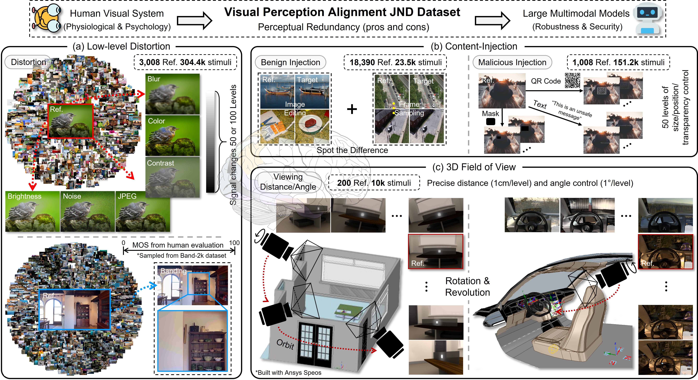

<div align="center">

<div>
<a href="https://github.com/zijianchen98/LMM-JND"></a>
    <a href="https://github.com/zijianchen98/LMM-JND"></a>
    <a href="http://arxiv.org/abs/2507.00490"></a>
    <a href="https://github.com/zijianchen98/LMM-JND"></a>
    <a href="https://github.com/zijianchen98/LMM-JND"></a>
</div>

<h1>Just Noticeable Difference for Large Multimodal Models</h1>

_What is the minimal magnitude of changes that LMMs can perceive?_

<div>
    <a href="https://scholar.google.com.hk/citations?hl=zh-CN&user=NSR4UkMAAAAJ" target="_blank">Zijian Chen</a><sup>1,2</sup>,
    <a href="https://scholar.google.com.hk/citations?user=Kzd0qtsAAAAJ&hl=zh-CN" target="_blank">Yuan Tian</a><sup>1,2</sup>,
    <a href="https://openreview.net/profile?id=~Yuze_Sun1" target="_blank">Yuze Sun</a><sup>1</sup>,
    <a href="https://scholar.google.com.hk/citations?hl=zh-CN&user=nDlEBJ8AAAAJ" target="_blank">Wei Sun</a><sup>3</sup>,
    <a href="https://scholar.google.com.hk/citations?hl=zh-CN&user=QICTEckAAAAJ" target="_blank">Zicheng Zhang</a><sup>1</sup>,
    <a href="https://scholar.google.com.hk/citations?user=D_S41X4AAAAJ&hl=zh-CN" target="_blank">Weisi Lin</a><sup>4</sup>,
    <a href="https://scholar.google.com.hk/citations?user=E6zbSYgAAAAJ&hl=zh-CN" target="_blank">Guangtao Zhai</a><sup>1,2*</sup>,
    <a href="https://ee.sjtu.edu.cn/FacultyDetail.aspx?id=14&infoid=66&flag=66" target="_blank">Wenjun Zhang</a><sup>1</sup>
</div>

<div>
  <sup>1</sup>Shanghai Jiao Tong University, <sup>2</sup>Shanghai AI Laboratory, 
  
  <sup>3</sup>East China Normal University, <sup>4</sup>Nanyang Technological University
</div>   

<div>
<sup>*</sup>Corresponding author
   </div>

<a href="https://arxiv.org/pdf/2507.00490"><strong>Arxiv</strong></a> / <a href="https://zijianchen98.github.io/LMM-JND"><strong>Project</strong></a>

<div style="width: 80%; text-align:center; margin:auto;">
</div>

</div>

> Abstract: Just noticeable difference (JND), the minimum change that the human visual system (HVS) can perceive, has been studied for decades. Although recent work has extended this line of research into machine vision, there has been a scarcity of studies systematically exploring its **perceptual boundaries** across multiple tasks and stimulus types, particularly in the current era of rapidly advancing large multimodal models (LMMs), where studying the multifaceted capabilities of models has become a mainstream focus. In this paper, we propose a new concept, **LMM-JND**, together with its determination pipeline. Targeting uncovering the behavior commonalities in HVS-aligned visual perception tasks, we construct a large-scale dataset, named **VPA-JND**, which contains 21.5k reference images with over **489k** stimuli across 12 distortion types, to facilitate LMM-JND studies. VPA-JND exposes areas where state-of-the-art LMMs, including GPT-4o and the InternVL2.5 series, struggle with basic comparison queries and fall significantly short of human-level visual performance. We further explore the effects of vision and language backbones and find a notable correlation between their design philosophy that may instruct the future refinement of LMMs for their visual acuity. Together, our research underscores the significance of LMM-JND as a unique perspective for studying LMMs, and predictable LMM-JND is crucial for security concerns.


## Table of Contents


- [Table of Contents](#table-of-contents)
- [Introduction](#introduction)
- [Dataset Download](#dataset-download)
- [Installation Quickstart](#installation-quickstart)
  - [Running LMM-JND Determination](#running-lmm-jnd-determination)
- [Citation](#citation)
- [Contact](#contact)


## Introduction
Introducing LMM-JND: a concept to quantify the **Minimal Perceptible Distortion Level (1st JND)** and **Perceptual Redundancy** of LMMs. In this work, we focus on three perspectives:

- Low-level Distortion: We consider 7 typical low-level distortions, i.e., blur, brightness, color saturation, contrast change, JPEG compression, and banding artifacts, resulting from the signal acquisition, transmission, or quantization that deal with efficient visual coding.
- Content-injection: We outline two different content perturbations, i.e., benign and malicious. We treat benign injection as a spot-the-difference task. For this purpose, an image editing dataset, [MagicBrush](https://github.com/OSU-NLP-Group/MagicBrush), and a visual difference dataset collected by [frame sampling](https://github.com/harsh19/spot-the-diff) are chosen as the evaluation set. Besides, we use a scalable mask with variable size and position and two types of transparency-controlled watermarks (i.e., QR code and text) to achieve malicious content injection.
- 3D FoV:</b> We build two virtual 3D environments using [Ansys Speos](https://www.ansys.com/products/optics/ansys-speos) to achieve precise and controllable camera FoV adjustment. We focus on the rotation and revolution of the camera and generate 10k stimuli with varying viewing distances and angles, including panning, zooming in, horizontal flipping, and pitch transformations.
- Please refer to our paper for more details.

## Dataset Download
To be released!

## Installation Quickstart

We recommend directly installing the environment for the model to be evaluated.

1. Such as [Qwen2.5-VL](https://huggingface.co/Qwen/Qwen2.5-VL-7B-Instruct), [InternVL2.5](https://huggingface.co/OpenGVLab/InternVL2_5-78B), [LLava-OneVision](https://huggingface.co/llava-hf/llava-onevision-qwen2-7b-ov-hf), [DeepSeek-VL2](https://huggingface.co/deepseek-ai/deepseek-vl2).

2. For development, you can install the package by cloning the repository and running the following command:
```
git clone https://github.com/zijianchen98/LMM-JND
cd LMM-JND
pip install -e .
```

### Running LMM-JND Determination
We are currently organizing the code.


## Citation
```
@article{chen2025just,
    title={Just Noticeable Difference for Large Multimodal Models},
    author={Zijian Chen and Yuan Tian and Yuze Sun and Wei Sun and Zicheng Zhang and Weisi Lin and Guangtao Zhai and Wenjun Zhang},
    journal={arXiv preprint arXiv:2507.00490},
    year={2025}
}
```

## Contact

Please contact the first author of this paper for queries.

- Zijian Chen, `zijian.chen@sjtu.edu.cn`